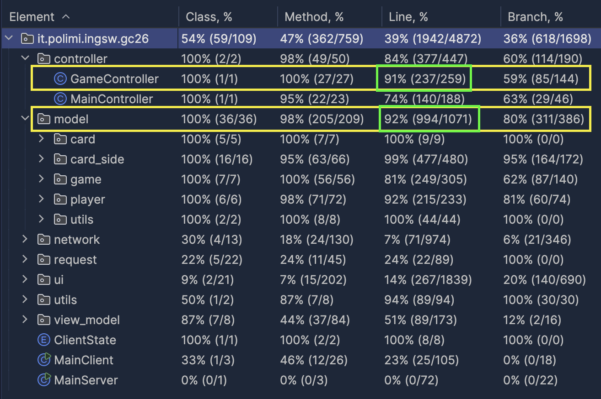

# Codex Naturalis
<h1 align="center">
  
</h1>
<h4>A distribuited version of the game Codex Naturalis  made by
  <a href="https://github.com/KevinThomaj" target="_blank">Kevin Thomaj</a>,
  <a href="https://github.com/GabrieleTonello" target="_blank">Gabriele Tonello</a>,
  <a href="https://github.com/lara-t" target="_blank">Lara Tongiorgi</a> ,
  <a href="https://github.com/karanbir-singh" target="_blank">Karanbir Singh</a>
</h4>

## What we have Implemented
We have implemented, in addiction to the `Game Specific` and `Game Agnostic` requirements,  the following advanced features:
| Feature | Implemented  |
|:--------|:----|
| Socket + RMI  | ✅ |
| TUI + GUI  | ✅ |
| Complete rules  | ✅ |
| Multiple Games   | ✅ |
| Chat  | ✅ |
| Server disconnections  | ✅ |

### Code Coverage

<h1 align="center">
  
</h1>

## How to Use
### From Github
1. Go to *deliverables*
2. Download `Codex_Naturalis_Server.jar`
2. Download `Codex_Naturalis_Client.jar`
4. Open `CMD` (or `Terminal` on macOS)
5. Go to the directory containing the previous downloaded jar files
6. From here:  
-> `java -jar Codex_Naturalis_Server.jar` (to run the server)  
-> `java -jar Codex_Naturalis_Client.jar` (to run the client)  
   *(on Windows, before running client, run this command: C:\\> **chcp 65001**)*

### From IntelliJ
1. Intellij: maven `menù -> codex_naturalis -> Lifecycle -> Clean` 
2. Intellij: maven `menù -> codex_naturalis -> Lifecycle -> Package` 
3. Open `CMD` (or `Terminal` on macOS), on project directory and go to:   
   -> [**path to project**]/ing-sw-2024-singh-thomaj-tonello-tongiorgi/target  
   From here:  
   -> `java -jar GC26-1.0-Server.jar` (to run the server)  
   -> `java -jar GC26-1.0-Client.jar` (to run the client)  
   *(on Windows, before running client, run this command: C:\\> **chcp 65001**)*

> [!WARNING]  
> For a better experience, launch TUI only on Windows CMD

## Running Server
You need to insert the port of the RMI registry (press `Enter` to set the default port 1090) 
and the port of the ServerSocket (press `Enter` to set the default port 3060).

On the question `Do you want to restore games from backup? (yes/no)`:
1. press `no` if you want to reset the server (it discards all the backed up games)
2. press `yes` if you want to restore backed up games when server disconnects  
   -> (use it only when the server went down and there were ongoing games)

> [!WARNING]  
> For macOS, we don't garantee that clients can connect with RMI, if they're not running on the same machine of the server

## Running Client
* You need to insert the IP of the server, the port of the RMI Registry and the port of the ServerSocket
(the same ones chosen for the server)
* You need to select if you want to launch client with RMI or socket.
* You need to select if you want to launch TUI (Terminal UI) or GUI (Graphical UI).

### Creating and joining game
We decided to not modify the game specific, even if we have to manage multiple games:  
* If there are no games being started, a new game is created, otherwise the user automatically joins the game being started.
* The player who creates the game chooses the number of players who will take part in it.
* If there is a game starting, the player is automatically added to the game.
* The game starts as soon as the expected number of players is reached (based on the choice made by the first player when creating the game).
